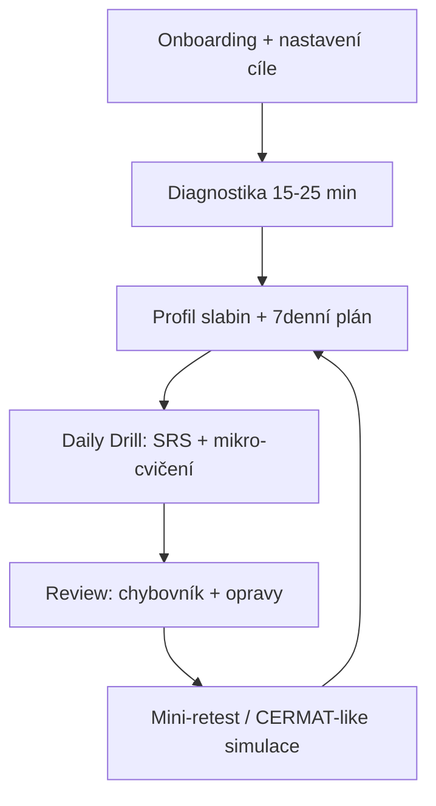
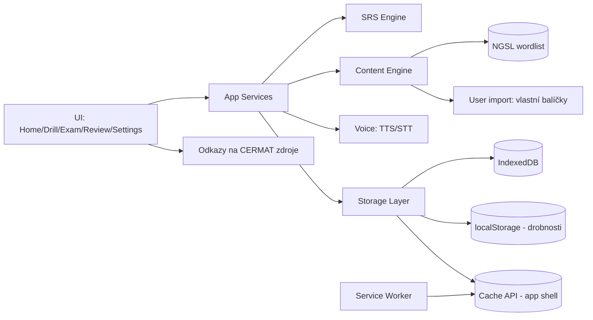
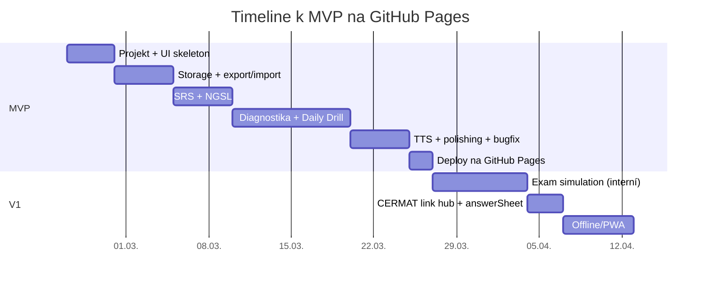

# Návrh statické webové aplikace pro přípravu na angličtinu k maturitě na GitHub Pages

## Executive summary

Cíl je postavit jednoduchou, spolehlivou webovou aplikaci hostovanou na GitHub Pages, která bez serveru pomůže studentce s nízkou úrovní (~A1) zvednout reálnou dovednost i výkon v maturitním didaktickém testu z angličtiny. Jádro má být „cyklus zlepšování“: rychlá diagnostika → denní krátké drily (slovní zásoba + mikro‑gramatika + čtení/poslech) → pravidelná simulace testu ve formátu podobném CERMAT → rozbor chyb → retest. Formát didaktického testu cizího jazyka je standardizovaný (10 částí, 64 úloh, 110 minut, max 100 bodů, hranice úspěšnosti 44 bodů; poslech 40 minut a čtení+jazyková kompetence 70 minut). citeturn11view0turn14view0

Klíčové omezení: oficiální CERMAT testové sešity, klíče i audio nahrávky jsou autorskoprávně chráněné; veřejné vystavování kopií či další zpřístupňování bez souhlasu je problém. Bezpečná strategie pro veřejný GitHub Pages web je proto **linkovat na oficiální zdroje** a případně umožnit **uživatelský import** materiálů stažených z oficiálních stránek pro osobní použití (nikoli je hostovat v repozitáři). citeturn5view0turn0search1

Doporučené minimum funkcí (MVP): onboarding + diagnostika (rychlý test a profil slabin), denní trénink (SRS slovíčka z NGSL + mikro‑cvičení z chyb), režim „exam timer + answer sheet“ kompatibilní s CERMAT strukturou, a přehledná stránka „co teď trénovat“ (na základě chyb a retence). NGSL je vhodný základ slovní zásoby a je pod licencí CC BY‑SA 4.0, takže je možné jej legálně embednout (s atribucí). citeturn3search1turn3search15

Neurčité parametry (UI framework apod.) jsou otevřené volby; níže je doporučen minimální stack a rozhodovací body.

## Kontext a nevyjednatelná omezení

Didaktický test z angličtiny ve společné části maturity vychází z CEFR/SERRJ a katalog je připraven s ohledem na úroveň B1. citeturn8view0turn8view1turn11view0 Důležité pro produkt: cílem není „B2“, ale zvládnout B1‑typ úloh a získat dost bodů (ideálně s rezervou). Hranice úspěšnosti je 44 bodů ze 100. citeturn11view0turn10view0turn14view0

Od jara 2024 došlo ke změně v ověřování jazykové kompetence: část byla rozdělena a test má 10 částí; zároveň zůstává 110 minut a hranice 44 %. citeturn14view0turn11view0 Pro návrh „exam simulátoru“ je tedy zásadní držet se aktuální struktury 10 částí a bodových vah (CERMAT uvádí vyvážení 40 poslech / 40 čtení / 20 jazyková kompetence). citeturn14view0turn11view0

Profilová část (písemná práce, ústní) je od školního roku 2020/2021 stanovena školou bez návaznosti na katalog; aplikace by ji měla řešit jako volitelnou, konfigurovatelnou nadstavbu (šablony a checklisty), ne jako „jeden univerzální obsah“. citeturn6view0turn11view0

Licenční rámec CERMAT: testové sešity, klíče, vzorové úlohy a audio nahrávky jsou chráněny autorským právem; šíření či další zpřístupňování bez souhlasu je problém, ale zveřejňování odkazů na webové stránky CERMAT je povoleno. citeturn5view0turn4view0 Prakticky to znamená: na veřejném GitHub Pages webu **nehostovat** kopie PDF/ZIP ani přepsané úlohy z oficiálních testů; místo toho poskytovat odkazy a případně import „uživatel si přinese vlastní soubory“.

Hostování na GitHub Pages znamená čistě statický web (HTML/CSS/JS) s limity: publikovaný web max ~1 GB, deployment timeout 10 minut, soft bandwidth limit 100 GB/měsíc. citeturn12search8turn1search2 V kombinaci s tím, že oficiální poslechové subtesty jsou běžně desítky MB (např. ZIP ~39 MB u jedné sady), by embedování audio archivů rychle limity překročilo. citeturn0search1turn1search2

Časový kontext: pro jarní období 2026 jsou didaktické testy v rozmezí 4.–7. května 2026. citeturn11view0 Pokud je horizont přípravy ~1 rok, aplikace musí být disciplinovaná v prioritách (malé denní dávky, jasná zpětná vazba), protože posun A1→B1 je velký. Orientačně se uvádí cca 200 „guided learning hours“ na posun o jednu CEFR úroveň (hrubý odhad), případně B1 kolem 350–400 kumulativních hodin dle tabulek uváděných institucemi napojenými na Cambridge/British Council. citeturn13search0turn13search2

## Cíle, persony a měření úspěchu

**Primární cíle aplikace**
- Zvednout pravděpodobnost „uspěl(a)“ v didaktickém testu: cílit na stabilní výkon nad hranicí 44 bodů a bezpečnější pásmo (např. 60+), při zachování časového limitu 110 minut. citeturn11view0turn14view0
- Snížit úzkost: jasná rutina, predikovatelný denní objem, „malá vítězství“ (retence slovíček, zlepšení v jedné části testu).
- Zvednout obecnou použitelnost angličtiny (základní poslech/čtení a minimální produktivní dovednost), ale **bez** ambice pokrýt vše jako plnohodnotný kurz.

**Persony**
- Studentka „Ségra“: ~A1, nízké sebevědomí, snadno se zahltí. Potřebuje: velmi jasné kroky, krátké interakce, okamžitou zpětnou vazbu, minimální nastavení, offline režim (např. na mobilu). Důležitý je pocit kontroly: „vím, co dělat dnes“.
- Implementer/učitel (ty): chce rychle nasadit statický web, upravit obsah bez serveru, diagnostikovat slabiny, a občas zkontrolovat pokrok přes export dat.

**Success metrics (měřitelné v appce, bez serveru)**
- Výkonové: skóre v interních „CERMAT‑like“ simulacích v čase; zvlášť poslech/čtení/jazyk. Bodové váhy a struktura mají odpovídat CERMAT (40/40/20; 10 částí; 110 minut). citeturn14view0turn11view0
- Procesní: počet dokončených denních sezení týdně; průměrná délka; dokončené SRS repetice.
- Retence: procento úspěšných opakování v SRS (7/30/90 dní).
- „Exam readiness“: zvládnutí časového tlaku (dokončení do limitu 110 minut, nebo 40/70 po subtestech). citeturn11view0turn14view0
- Subjektivní: krátký 10s check‑in po sezení („bylo to ok/těžké“) pro adaptaci dávky.

## Prioritizovaný feature list a důvody

Níže je seznam bez „nice‑to‑have“ prvků (sociální funkce, gamifikace, účty, cloud sync) – ty typicky vyžadují server nebo zhoršují fokus.

**MVP (cílem je nasazení rychle, stabilně, s jasným efektem)**
- Onboarding + konfigurace cíle: datum zkoušky, preferovaný čas denně, jazyk UI (CZ), TTS hlas/rychlost, a volba „chci hlavně maturitu“ vs „chci obecnou AJ“ (jen váhy tréninku).
- Rychlá diagnostika (15–25 min): krátký mix poslech/čtení/jazyk (autorské úlohy nebo otevřený obsah) → výstup: „3 největší díry“ a návrh prvního týdne.
- Denní „Daily Drill“ (10–30 min):  
  - SRS slovíčka z NGSL (začít s malým subsetem; zbytek postupně). citeturn3search1turn3search15  
  - 5–10 mikro‑cvičení generovaných z chyb (cloze, výběr, krátká odpověď).
  - TTS pro každé nové slovo/větu (SpeechSynthesis). citeturn2search2turn2search10turn16view0
- Review obrazovka: chybovník + „opravné kolo“ (znovu ty samé typy, ale s variací).
- Lokální ukládání progrese + export/import (JSON) a „reset“; vše bez serveru (IndexedDB). citeturn2search8turn2search0

**V1 (po ověření, že MVP funguje a studentka ho fakt používá)**
- Exam simulation „CERMAT‑like“: 110min timer, rozdělení na poslech (40) a čtení+jazyk (70), bodové váhy 40/40/20, 10 částí. citeturn11view0turn14view0  
  Obsah bude autorský nebo otevřeně licencovaný – ne přepsaný CERMAT.
- „CERMAT zdroje“ modul: přehled odkazů na oficiální testy (PDF, klíče, poslech ZIP) a doporučený postup, jak je používat; **bez embedování**. citeturn0search1turn5view0
- „Answer sheet“ pro práci s oficiálním testem: uživatel si otevře PDF vedle, v appce pouze vyplní odpovědi 1–64; vyhodnocení buď ruční zadáním klíče (copy‑paste), nebo ručním skóre po částech. Tím se vyhneš šíření obsahu, ale získáš data pro trend. citeturn11view0turn5view0
- Offline režim (PWA „app shell“ + cache) a upozornění na storage kvóty. citeturn2search11turn2search17turn2search1

**V2 (jen pokud je stabilní používání; cílit na mluvení a motivaci)**
- Speaking drill: TTS věta → studentka zopakuje → (volitelně) SpeechRecognition transkript a jednoduché porovnání slov (ne „výslovnostní skóre“); fallback: nahrávání (MediaRecorder) a self‑check. Web Speech recognition je omezený kompatibilitou a typicky defaultně server‑based; musí to být opt‑in. citeturn16view0turn2search7turn2search6
- Import vlastních sad úloh (teacher‑authored JSON): umožní rychle přidat školní okruhy, fráze, slovníky bez zásahu do kódu.

Otevřené volby (bez constraintu): UI framework (vanilla TS / React / Svelte), router (žádný vs hash‑router), formát content balíčků (JSON vs YAML), test runner rozsah.

## UX flows pro klíčové úlohy

Níže jsou implementačně konkrétní toky (co mají dělat obrazovky a co logovat).

**Diagnostika**
1. „Start diagnostiky“: vysvětlit délku (např. 20 min), že nejde o známku.  
2. Poslech mini‑blok (např. 6–8 úloh) + čtení mini‑blok (6–8) + jazyk (6–8).  
3. „Výsledky“: rozpad na 3 oblasti (poslech/čtení/jazyk), ukázat 3 nejčastější typy chyb (např. prepozice, minulý čas, porozumění detailu).  
4. „Plán na 7 dní“: automaticky nastavit denní dávku (SRS new cards/day, drill difficulty).  
5. Uložit baseline: `diagnosticSession` v DB a vytvořit první „priority tags“ (např. `grammar.present_simple`, `vocab.ngsl_band_1`).

**Daily Drill**
1. Home: velké tlačítko „Dnes“ + odhad času (10/20/30 min).  
2. Block A (SRS): 10–25 karet podle dostupného času; každá karta: front (EN + audio) → back (CZ význam / příklad) → self‑grade (0–3).  
3. Block B (Micro‑practice): 5–10 úloh z chyb (cloze/multiple choice).  
4. Konec: souhrn „co se zlepšilo“ + doporučení „zítra“.  
5. Uložit: `reviewLog`, `drillSession`, aktualizace SRS plánů.

**Exam simulation**
1. Výběr režimu: „CERMAT‑like simulace“ (interní obsah) vs „Timer + answer sheet (oficiální PDF vedle)“.  
2. Pokud interní simulace: sekce poslech 40 min → pause → čtení/jazyk 70 min; průběžně zobrazovat část a zbývající čas. citeturn11view0turn14view0  
3. Po odevzdání: skóre celkem i po oblastech; highlight „nejvíc bodů ztraceno“; nabídnout retest mod „jen slabé části“.  
4. Uložit `examSession` + `itemResults` (u interních).

**Review**
1. „Chyby týdne“: top 10 chyb podle frekvence a závažnosti (body).  
2. Pro každou chybu: krátké pravidlo + 2 příklady + 3 navazující úlohy.  
3. Po týdnu: automaticky nabídnout „Mini‑retest“ ze stejné oblasti a porovnat s baseline.

Mermaid: flow diagnostika → drill → retest



## Technický návrh pro implementaci bez serveru

### Minimal tech stack

Dvě rozumné minimalistické varianty:

- **Vite + TypeScript + vanilla komponenty** (doporučení pro nejmenší overhead): jednoduchá build pipeline, malé bundle, snadná práce s IndexedDB. GitHub Pages je statický hosting a Vite build do `dist` je typický. citeturn12search8turn12search2  
- **Vite + React/Preact/Svelte**: pokud chceš rychlejší UI iteraci a komponentový model; u GitHub Pages řešit routing buď bez routeru, nebo hash‑router (kvůli refresh/URL). GitHub Pages je statické prostředí bez server rewrite. citeturn12search8turn12search3

Doporučené knihovny (volitelné, ale praktické): `idb` (wrapper nad IndexedDB), `zod` (validace importů), lehký router (hash).

### Architektura aplikace



GitHub Pages jako hosting: statické soubory, žádný backend. citeturn12search8 Offline „app shell“ řešit Service Worker + Cache API. citeturn2search17turn2search18

### Ukládání dat: volba a srovnání

| Úložiště | Vhodné pro | Plusy | Mínusy / rizika | Doporučení |
|---|---|---|---|---|
| `localStorage` | drobné nastavení (theme, poslední obrazovka) | jednoduché | synchronní (může blokovat), ne pro velká data; nelze v service workeru | používat minimálně citeturn2search4turn2search11 |
| **IndexedDB** | progress, SRS karty, logy sezení, importované balíčky | asynchronní; vhodné i offline; pojme strukturovaná data a blobs | kvóty se liší dle prohlížeče; potřeba migrací schématu | hlavní databáze citeturn2search0turn2search8turn2search1 |
| Cache API | statické assety (HTML/CSS/JS), malý obsah pro offline | rychlé offline načtení | browser může cache vymazat; kvóty; správa invalidace | pouze app shell + malý content citeturn2search18turn2search1 |
| StorageManager `estimate/persist` | kontrola prostoru a snížení rizika eviction | umí vrátit usage/quota a požádat o „persistent storage“ | prohlížeč nemusí vyhovět; UX s permission | použít pro upozornění a opt‑in „udržet data“ citeturn2search5turn2search15turn2search1 |

Poznámka pro implementaci: udržuj vše v jednom originu a měj „Export“ jako záchranu proti eviction; pro audio import neukládat automaticky, vždy se ptát na velikost a hlídat `navigator.storage.estimate()`. citeturn2search5turn2search1

### Datový model

Navržené „object stores“ v IndexedDB (verzované schéma, migrace):

- `settings` (key `singleton`): UI jazyk, TTS hlas, denní budget, datum zkoušky.
- `user` (key `userId=default`): baseline, self‑report, streak.
- `deck` (key `deckId`): např. `ngsl_core`, `my_mistakes`.
- `card` (key `cardId`): `front`, `back`, `tags`, `source`, `license`, `ttsHints`.
- `srsState` (key `cardId`): `dueAt`, `intervalDays`, `ease`, `lapses`, `lastGrade`.
- `reviewLog` (key auto): `timestamp`, `cardId`, `grade`, `ms`.
- `drillSession` (key auto): `date`, `plannedMinutes`, `doneMinutes`, `modulesDone`.
- `examSession` (key auto): `type` (`internal`/`timer_only`), `startedAt`, `endedAt`, `scoreTotal`, `scoreBySkill`, `notes`.
- `errorItem` (key auto): `sourceSessionId`, `skill`, `pattern`, `example`, `nextPracticeAt`.

Indexy: `srsState.dueAt`, `reviewLog.cardId+timestamp`, `errorItem.nextPracticeAt`, `examSession.startedAt`.

### SRS: volby algoritmu a doporučení

Aplikace má být jednoduchá, predikovatelná a lokálně robustní. SM‑2 je osvědčený, dobře implementovatelný a relativně nenáročný; existuje veřejný popis. citeturn3search6turn3search3

| Algoritmus | Jak funguje (zjednodušeně) | Plusy | Mínusy | Doporučení |
|---|---|---|---|---|
| Fixed interval | opakovat po 1/3/7 dnech bez adaptace | nejjednodušší | špatná personalizace; plýtvá časem | ne |
| Leitner boxy | správně → vyšší box (delší interval), špatně → zpět | jednoduchý a srozumitelný | hrubé kroky; horší pro mix dovedností | OK pro úplné MVP |
| **SM‑2 (zjednodušený)** | uživatel dá známku, upraví se interval + ease faktor | dobrý poměr jednoduchost/efekt; standardní praxe | potřebuje self‑grading; edge cases | doporučeno pro MVP/V1 citeturn3search6turn3search3 |

Praktická implementace (zjednodušené škálování pro A1):
- Grades 0–3 (místo 0–5): 0 = nevím, 1 = špatně, 2 = správně s námahou, 3 = snadno.
- Start intervaly: 1 den, 3 dny, 7 dní; pak `interval *= ease`.
- „New cards/day“ limit velmi nízký (např. 5–10) + adaptace podle úspěšnosti.

### TTS a rozpoznávání řeči

Web Speech API pokrývá dvě části: SpeechSynthesis (TTS) a SpeechRecognition (STT). citeturn2search2turn16view0

| Přístup | Offline | Kompatibilita | Náklady | Poznámky | Doporučení |
|---|---|---|---|---|---|
| **SpeechSynthesis (Web Speech API)** | často ano (záleží na OS/hlasech) | široká (TTS je běžně podporované) | zdarma | hlas/rychlost podle zařízení; bez záruky stejného hlasu | hlavní TTS citeturn2search10turn16view0 |
| Předgenerované audio (mp3) | ano | univerzální | vysoké (storage) | velké assety; GitHub Pages limity; licenční a velikostní rizika | nedoporučeno citeturn1search2turn0search1 |
| Cloud TTS (API) | ne | univerzální | platby/klíče | typicky vyžaduje server kvůli klíčům; privacy | ne |

SpeechRecognition: MDN uvádí, že defaultně je rozpoznávání server‑based (audio se posílá službě, nefunguje offline) a existuje možnost on‑device režimu, která je ale závislá na podpoře a jazykových balíčcích. citeturn16view0turn2search6 Kompatibilita je omezená (např. ne všude je dostupné), proto má být ve V2 pouze jako opt‑in. citeturn2search7turn2search6

Offline strategie:
- Service worker pro app shell; lokální DB pro progress. Service worker běží asynchronně a nemůže používat `localStorage`, ale může používat IndexedDB. citeturn2search17turn2search11

### Konfigurační formát

Konfigurace má být čitelná a přenositelná; pro runtime je nejjednodušší JSON, pro repo může být YAML.

Příklad `config.json` (uživatelské nastavení):

```json
{
  "appVersion": "1.0",
  "locale": "cs-CZ",
  "target": {
    "examName": "Maturita AJ (CERMAT didaktický test)",
    "examDate": "2027-05-05",
    "goalScore": 60
  },
  "dailyPlan": {
    "minutesPerDay": 25,
    "daysPerWeek": 6,
    "newCardsPerDay": 8,
    "maxReviewsPerDay": 40
  },
  "weights": {
    "vocabSrs": 0.45,
    "grammarMicro": 0.25,
    "reading": 0.20,
    "listening": 0.10
  },
  "tts": {
    "enabled": true,
    "lang": "en-GB",
    "rate": 0.95,
    "pitch": 1.0,
    "voiceNameHint": "Google UK English Female"
  },
  "speechRecognition": {
    "enabled": false,
    "processLocallyIfAvailable": true,
    "lang": "en-GB"
  },
  "privacy": {
    "analyticsEnabled": false,
    "requireOptInForMic": true
  }
}
```

Příklad `content-pack.yaml` (teacher balíček – vlastní cvičení):

```yaml
pack_id: "basic-grammar-a1-a2"
title: "A1/A2 mikro-gramatika"
license: "CC-BY-4.0"
items:
  - id: "present-simple-01"
    type: "cloze"
    prompt: "She ____ (go) to school every day."
    answer: "goes"
    tags: ["grammar.present_simple", "3rd_person_s"]
  - id: "prepositions-01"
    type: "mcq"
    prompt: "I'm interested ____ music."
    options: ["in", "on", "at"]
    answerIndex: 0
    tags: ["grammar.prepositions"]
```

### Příklad exportu progrese (opt‑in)

```json
{
  "exportedAt": "2026-02-24T20:15:00+01:00",
  "userId": "default",
  "settings": {
    "locale": "cs-CZ",
    "targetExamDate": "2027-05-05",
    "goalScore": 60
  },
  "stats": {
    "streakDays": 12,
    "totalStudyMinutes": 860,
    "lastExamScore": 52
  },
  "srs": {
    "deckId": "ngsl_core",
    "cards": [
      {
        "cardId": "ngsl:00123",
        "front": "because",
        "back": "protože",
        "tags": ["ngsl.band1"],
        "state": {
          "dueAt": "2026-02-26T06:00:00Z",
          "intervalDays": 3,
          "ease": 2.2,
          "lapses": 1
        }
      }
    ]
  },
  "examSessions": [
    {
      "id": "exam:2026-02-20",
      "type": "internal",
      "scoreTotal": 48,
      "scoreBySkill": { "listening": 18, "reading": 20, "language": 10 },
      "durationMinutes": 110
    }
  ]
}
```

## Obsah, zdroje a licence

**Oficiální maturitní materiály**
- CERMAT zveřejňuje testy, záznamové archy, klíče a poslechy z předchozích období na svém webu; pro angličtinu jsou k dispozici PDF a poslechové ZIPy. citeturn0search1turn0search7
- Pravidla využití obsahu explicitně povolují zveřejňování odkazů bez souhlasu, zatímco další zpřístupňování a šíření testové dokumentace bez souhlasu je problematické. citeturn5view0turn4view0

**Doporučený postup v appce (bez licenčního rizika)**
- V appce mít sekci „Oficiální zdroje“: pouze odkazy + návod „jak stáhnout a pracovat“.
- Pro „práci s oficiálním testem“ nabídnout jen timer a answer sheet (bez samotného obsahu úloh) a volitelně ruční zadání klíče/počtů chyb.
- Pokud přidáš import souborů: jasně označit, že uživatel importuje materiály, které si sám stáhl z oficiálního zdroje, a že se nikam neuploadují (zůstávají lokálně).

**Slovní zásoba (priorita)**
- NGSL jako základní seznam frekventované slovní zásoby pro obecnou angličtinu, s licencí CC BY‑SA 4.0 (použitelné v appce s atribucí). citeturn3search1turn3search15
- Pro jednoduchost: začít „core 500–800“ a zbytek odemykat postupně podle retence a výkonu.

**Otevřené zdroje pro příklady/věty (volitelné)**
- Tatoeba corpus: textové věty pod CC BY 2.0 FR; použitelné, ale vyžaduje atribuci autorů – organizačně náročnější. citeturn15search0turn15search35
- Wiktionary: dual‑license CC BY‑SA 4.0 + GFDL; použití je možné, ale vyžaduje atribuční a share‑alike disciplínu. citeturn15search1  
Praktické doporučení: do MVP raději psát vlastní jednoduché věty a pravidla (to eliminuje atribuci), otevřené korpusy přidat až ve V2.

## Testování, nasazení na GitHub Pages, bezpečnost a roadmap

### Deployment a CI na GitHub Pages

GitHub Pages je statický hosting; typicky budeš buildit do `dist/` a publikovat přes GitHub Actions. citeturn12search8turn12search1turn12search0 GitHub uvádí, že GitHub Actions je doporučený přístup pro deployment a automatizaci Pages. citeturn12search15turn12search1 Pokud publikuješ čistě statické soubory, je běžné přidat `.nojekyll` (zabrání Jekyll procesu při branch deploy). citeturn12search2turn12search0

Praktické build/deploy příkazy (Vite):
- `npm ci`
- `npm run build`
- výstup `dist/` publikovat jako Pages artifact přes workflow (configure‑pages → upload‑pages‑artifact → deploy‑pages).

Limity, které ovlivní návrh: max 1 GB publikovaný web, 10 minut na deployment a soft 100 GB/měsíc bandwidth. citeturn1search2 Proto: žádné velké audio assety v repu.

HTTPS: GitHub Pages podporuje HTTPS; offline/PWA je bezpečnější na HTTPS. citeturn12search19

Routing: pro minimalismus doporučuju **bez history routeru** (jedna stránka + interní navigace) nebo hash‑router, protože GitHub Pages nemá server rewrite a refresh na deep URL může končit 404. citeturn12search3turn12search20

### Bezpečnost a soukromí

- Default: žádná analytika, žádné externí trackery (výslovně).  
- Všechna data lokálně (IndexedDB); export je **opt‑in**. citeturn2search8turn2search0
- Mikrofon: vždy explicitní souhlas a jasný text „Speech recognition může být server‑based a posílat audio službě; offline to standardně nefunguje“. MDN přímo uvádí, že defaultní rozpoznávání je server‑based a audio se posílá webové službě; on‑device režim existuje jako volba pro soukromí. citeturn16view0turn2search6

### Roadmap a odhad pracnosti (person‑days)

Odhady jsou pro jednoho vývojáře, bez „content writing“ maratonů; největší riziko je obsah (kvalita úloh) a UX jednoduchost.

| Fáze / feature | Výstup | Odhad |
|---|---|---|
| Základ projektu + UI skeleton | navigace, layout, Settings, lokální i18n | 1.5–2 pd |
| IndexedDB schéma + export/import | stores, migrace v1, JSON export/import | 2–3 pd citeturn2search8turn2search0 |
| MVP SRS engine (zjednodušený SM‑2) | scheduling, due queue, grading, stats | 2–3 pd citeturn3search6 |
| NGSL ingest + deck builder | import NGSL, tagging, atribuce | 1–2 pd citeturn3search1 |
| Daily Drill flow | sestavení sezení, mikro‑úlohy z chyb, UX | 3–5 pd |
| Diagnostika + profil slabin | mini‑testy, scoring, doporučení | 3–4 pd |
| TTS integrace | výběr hlasu, rate/pitch, UX fallback | 1–2 pd citeturn2search10turn16view0 |
| V1 Exam simulation (interní obsah) | timer 110, subtest split, scoring | 3–5 pd citeturn11view0turn14view0 |
| CERMAT link hub + timer/answer sheet | odkazy, instrukce, answer grid 1–64 | 1–2 pd citeturn0search1turn5view0 |
| Offline/PWA | SW precache, cache policy, storage warnings | 2–4 pd citeturn2search17turn2search18turn2search1 |
| V2 Speaking (opt‑in) | STT/recording, disclaimers, fallback | 3–6 pd citeturn16view0turn2search7 |

Mermaid: realistická časová osa k prvnímu vydání



Rozhodovací body pro „cursor model“ implementaci:
- Jestli bude router: doporučení žádný nebo hash (kvůli GitHub Pages). citeturn12search3turn12search20  
- Jaký obsah do diagnostiky a simulací: autorský vs otevřeně licencovaný; oficiální CERMAT pouze linkovat. citeturn5view0turn0search1  
- Jak agresivně ukládat audio: default neukládat; jen TTS; import audio až ve V1/V2 s kontrolou kvót. citeturn2search5turn2search1  
- Jak jednoduchý SRS: Leitner pro úplné MVP vs SM‑2 rovnou; doporučení rovnou zjednodušený SM‑2. citeturn3search6